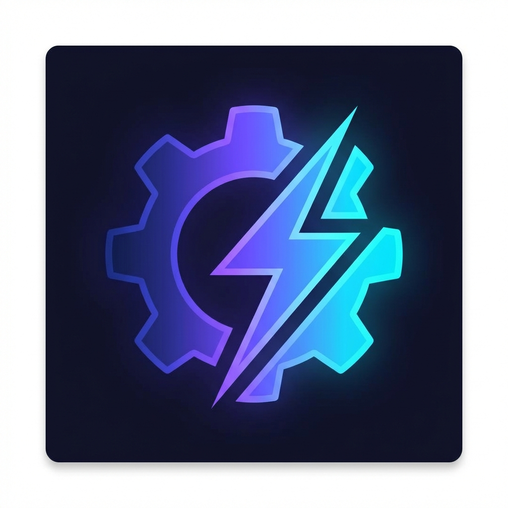
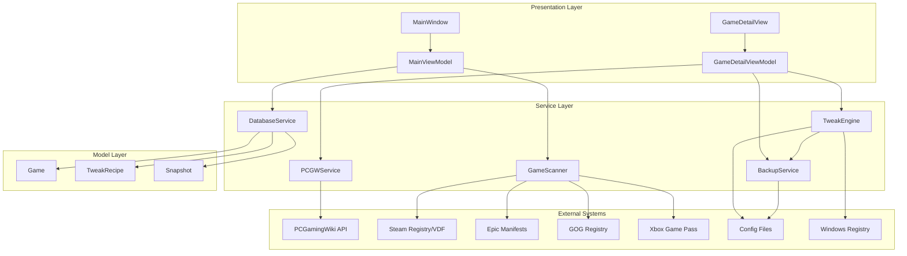

# OpenTweak

<p align="center">
  
</p>

<p align="center">
  <strong>🎮 The Transparent, Open-Source Alternative to Twiki</strong>
</p>

<p align="center">
  Automatically optimize your PC games with deterministic tweaks from PCGamingWiki — no black boxes, no guesswork, full transparency.
</p>

<p align="center">
  <a href="#features">Features</a> •
  <a href="#installation">Installation</a> •
  <a href="#usage">Usage</a> •
  <a href="#tech-stack">Tech Stack</a> •
  <a href="#architecture">Architecture</a> •
  <a href="#contributing">Contributing</a> •
  <a href="#license">License</a>
</p>

<p align="center">
  
  
  
</p>

---

## ✨ Why OpenTweak?

Most game optimization tools are **black boxes** — you don't know what they're doing to your system. OpenTweak is different:

| | OpenTweak | Other Tools |
|---|-----------|-------------|
| **Transparency** | ✅ Full source code available | ❌ Closed source |
| **Auditability** | ✅ Read exactly what each tweak does | ❌ Hidden operations |
| **Reversibility** | ✅ Automatic backups before any change | ❌ Often irreversible |
| **Reliability** | ✅ Deterministic recipes from PCGamingWiki | ❌ AI guesswork |
| **Privacy** | ✅ No telemetry, works offline | ❌ Cloud-dependent |

> *"Don't trust, verify."* — OpenTweak puts you in control of your gaming experience.

---

## 🚀 Features

### 🎯 Multi-Launcher Game Discovery
Automatically discovers installed games from all major PC gaming platforms:

- **Steam** — Scans library folders and app manifests
- **Epic Games Store** — Parses `.item` manifest files
- **GOG Galaxy** — Reads registry entries
- **Xbox Game Pass** — Scans WindowsApps folder
- **Manual Addition** — Add any game by path

### 📚 Deterministic Tweaks from PCGamingWiki
Fetches structured optimization data directly from [PCGamingWiki](https://www.pcgamingwiki.com) using the **Cargo API** — no brittle HTML scraping:

- Video settings (resolution, frame rate, VSync)
- Audio fixes (crackling, latency)
- Input optimizations (raw input, acceleration)
- Performance tweaks (shadow quality, draw distance)
- Bug fixes and workarounds

### 💾 Automatic Backup & Restore
**The "Holy Grail" feature:** Every configuration file is backed up before modification:

- One-click snapshot creation
- Full restore to previous state
- Multiple restore points per game
- Never worry about breaking your game

### 🎨 Windows 11 Modern UI
Built with [WPF-UI](https://github.com/lepoco/wpfui) for a native Windows 11 experience:

- Mica/Acrylic backdrop effects
- List/Grid view toggle
- Animated slide-over detail panel
- Fluent Design System
- Dark mode support

---

## 📸 Screenshots

<p align="center">
  
  <br>
  <em>Main library view with grid layout and search</em>
</p>

<p align="center">
  
  <br>
  <em>Game detail panel showing available tweaks</em>
</p>

<p align="center">
  
  <br>
  <em>Preview changes before applying with diff view</em>
</p>

> 📷 *Screenshots coming soon — help us by contributing screenshots of your setup!*

---

## 📥 Installation

### Option 1: Pre-built Binary (Recommended)

1. Download the latest release from [GitHub Releases](../../releases)
2. Run `OpenTweak.exe` — no installation required
3. Windows SmartScreen may show a warning (unsigned executable) — click "More info" → "Run anyway"

> 💡 **Want a signed binary?** See our [Distribution Guide](docs/DISTRIBUTION.md) for code signing options.

### Option 2: Build from Source

#### Prerequisites
- [.NET 8 SDK](https://dotnet.microsoft.com/download/dotnet/8.0)
- Windows 10/11
- Visual Studio 2022 or VS Code (optional)

#### Build Commands

```powershell
# Clone the repository
git clone https://github.com/yourusername/OpenTweak.git
cd OpenTweak

# Restore dependencies
dotnet restore

# Build the project
dotnet build --configuration Release

# Run the application
dotnet run --project OpenTweak
```

#### Publish Single-File Executable

```powershell
dotnet publish OpenTweak -c Release -r win-x64 --self-contained false -p:PublishSingleFile=true -o ./publish
```

The executable will be at `./publish/OpenTweak.exe`.

---

## 🎮 Usage Guide

### First Launch

1. **Scan for Games** — Click the "Scan" button to discover games from all launchers
2. **Select a Game** — Double-click or select a game to open the detail panel
3. **Fetch Tweaks** — OpenTweak automatically queries PCGamingWiki for available tweaks
4. **Preview Changes** — Review what will change before applying
5. **Apply Tweaks** — Click "Apply" to create a backup and apply changes

### Managing Snapshots

- Each tweak application creates a **snapshot** (backup)
- View all snapshots in the "Snapshots" tab
- Restore any previous state with one click
- Delete old snapshots to free up space

### Adding Manual Games

1. Click "Add Game" button
2. Enter game name and installation path
3. OpenTweak will scan for configuration files

---

## 🛠️ Tech Stack

| Layer | Technology | Purpose |
|-------|------------|---------|
| **Framework** | .NET 8 | Core runtime |
| **UI** | WPF + WPF-UI | Modern Windows 11 interface |
| **Database** | LiteDB | Local game/tweak storage |
| **Config Parsing** | Salaros.ConfigParser | Safe INI/CFG editing |
| **MVVM** | CommunityToolkit.Mvvm | ViewModel architecture |
| **Testing** | xUnit + Moq | Unit and integration tests |

### Dependencies

```xml
<PackageReference Include="WPF-UI" Version="3.0.0" />
<PackageReference Include="LiteDB" Version="5.0.17" />
<PackageReference Include="Salaros.ConfigParser" Version="0.3.8" />
<PackageReference Include="CommunityToolkit.Mvvm" Version="8.2.2" />
```

---

## 🏗️ Architecture

OpenTweak follows a clean layered architecture with clear separation of concerns:

### System Overview



### Data Flow

1. **Scan** → [`GameScanner`](OpenTweak/Services/GameScanner.cs) detects installed games
2. **Fetch** → [`PCGWService`](OpenTweak/Services/PCGWService.cs) queries PCGamingWiki API
3. **Preview** → [`TweakEngine`](OpenTweak/Services/TweakEngine.cs) generates diff view
4. **Backup** → [`BackupService`](OpenTweak/Services/BackupService.cs) creates snapshot
5. **Apply** → Safe config modification with Salaros.ConfigParser
6. **Restore** → One-click rollback from any snapshot

### Project Structure

```
OpenTweak/
├── Models/              # Domain models
│   ├── Game.cs
│   ├── TweakRecipe.cs
│   └── Snapshot.cs
├── Services/            # Business logic
│   ├── GameScanner.cs
│   ├── PCGWService.cs
│   ├── TweakEngine.cs
│   ├── BackupService.cs
│   └── DatabaseService.cs
├── ViewModels/          # MVVM ViewModels
│   ├── MainViewModel.cs
│   └── GameDetailViewModel.cs
└── Views/               # XAML views
    ├── MainWindow.xaml
    └── GameDetailView.xaml
```

For detailed architecture documentation, see [`docs/Architecture/Overview.md`](docs/Architecture/Overview.md).

---

## 🤝 Contributing

We welcome contributions! Here's how to get started:

### Development Setup

1. Fork the repository
2. Clone your fork: `git clone https://github.com/YOUR_USERNAME/OpenTweak.git`
3. Create a feature branch: `git checkout -b feature/amazing-feature`
4. Make your changes
5. Run tests: `dotnet test`
6. Format code: `dotnet format`
7. Commit: `git commit -m 'Add amazing feature'`
8. Push: `git push origin feature/amazing-feature`
9. Open a Pull Request

### Areas for Contribution

- 🎮 Additional launcher support (Ubisoft Connect, EA App, Battle.net)
- 🌍 Localization (translations)
- 🐛 Bug fixes and optimizations
- 📖 Documentation improvements
- 🎨 UI/UX enhancements
- 🧪 Additional test coverage

### Code Standards

- Follow existing code style (see `.editorconfig`)
- Write tests for new features
- Update documentation for API changes
- Keep commits focused and atomic

See [AGENTS.md](AGENTS.md) for our development workflow and standards.

---

## 📄 License

This project is licensed under the **PolyForm Shield License 1.0.0**.

### What You Can Do ✅

- Read and audit the full source code
- Build and use for personal use
- Modify for your own use
- Contribute improvements
- Share the project

### What You Cannot Do ❌

- Sell or redistribute commercially
- Create competing products
- Use for commercial purposes without permission

See [LICENSE.md](LICENSE.md) for the full license text.

---

## 🙏 Acknowledgments

- **[PCGamingWiki](https://www.pcgamingwiki.com)** — The invaluable community resource for PC game fixes and tweaks
- **[WPF-UI](https://github.com/lepoco/wpfui)** — Modern WPF controls and styling
- **[Salaros.ConfigParser](https://github.com/salaros/config-parser)** — Robust INI/CFG file parsing
- **[LiteDB](https://www.litedb.org/)** — Lightweight local NoSQL database
- **[CommunityToolkit.Mvvm](https://learn.microsoft.com/windows/communitytoolkit/mvvm/)** — MVVM toolkit for modern .NET

---

<p align="center">
  Made with ❤️ for the PC gaming community
</p>

<p align="center">
  <a href="https://github.com/yourusername/OpenTweak">⭐ Star us on GitHub</a> •
  <a href="https://github.com/yourusername/OpenTweak/issues">🐛 Report Issues</a> •
  <a href="https://github.com/yourusername/OpenTweak/discussions">💬 Join Discussions</a>
</p>
