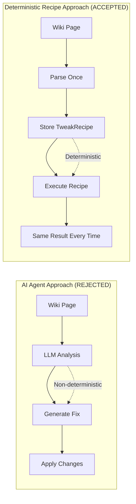
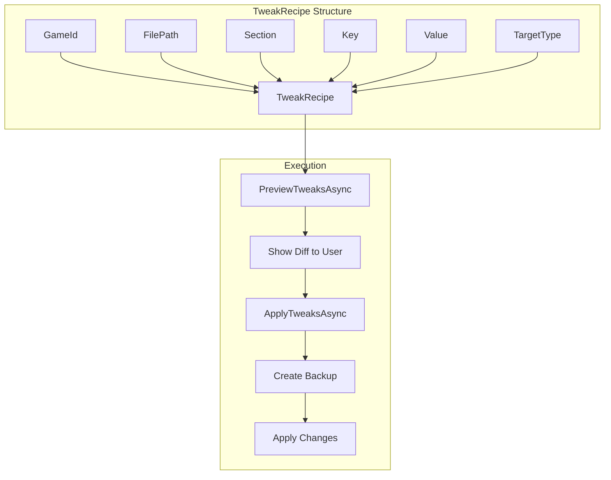

# ADR-001: Deterministic Tweak Recipes Over AI Agents

Status: Accepted
Date: 2026-02-01
Related Features: [`docs/Features/TweakEngine.md`](../Features/TweakEngine.md), [`docs/Features/PCGWIntegration.md`](../Features/PCGWIntegration.md)

---

## Context

OpenTweak needs to apply configuration changes to game files safely and reliably. There are two fundamental approaches to this problem:

1. **AI Agent Approach**: Use LLMs to "understand" the wiki instructions and generate fixes on the fly
2. **Deterministic Recipe Approach**: Parse wiki instructions once into structured recipes, then execute them the same way every time

The problem with AI agents is non-determinism. Given the same wiki page, an AI might generate different file modifications each time. This creates several issues:

- **Unpredictability**: Same input produces different outputs
- **Testing difficulty**: Cannot reliably test if a fix will work
- **Safety concerns**: AI might hallucinate incorrect file paths or values
- **Reproducibility**: Cannot guarantee the same fix works for all users
- **Transparency**: Users cannot see exactly what will change

Our goal is to provide a trustworthy tool that users can rely on to modify their game configurations without fear of breaking things.

---

## Decision

We will use **deterministic tweak recipes** parsed from PCGamingWiki instead of AI agents.

Key points:

- Recipes are parsed once from wiki text and stored as structured [`TweakRecipe`](../../OpenTweak/Models/TweakRecipe.cs) objects
- Each recipe contains exact file path, section, key, and value to modify
- Execution is deterministic: same recipe always produces the same result
- Recipes are validated before execution with a preview/diff view
- All changes are backed up before application

---

## Diagram

---

## Alternatives Considered

### Option A: AI Agent with Structured Output

- **Pros**: Could handle edge cases and variations in wiki format; more flexible
- **Cons**: Still non-deterministic; requires LLM API calls for every operation; expensive; latency issues; potential for hallucinations
- **Rejected because**: Non-determinism violates our core requirement for predictability and safety

### Option B: Hybrid AI + Rules

- **Pros**: Best of both worlds; AI for complex parsing, rules for execution
- **Cons**: Still requires AI for parsing; adds complexity; harder to test
- **Rejected because**: The deterministic parser is sufficient for PCGamingWiki's structured format; adding AI adds unnecessary risk

---

## Consequences

### Positive

- **Predictability**: Same wiki page always produces the same tweaks
- **Testability**: Can write unit tests for recipe extraction and execution
- **Transparency**: Users can see exactly what will change before applying
- **Safety**: No risk of AI hallucinating incorrect values or file paths
- **Performance**: No API calls needed during tweak application
- **Offline capable**: Once recipes are cached, no internet required

### Negative / Risks

- **Parser maintenance**: Wiki format changes may require parser updates
- **Limited flexibility**: Cannot handle truly novel or unusual wiki formats
- **Initial development**: Building a robust parser requires upfront effort

**Mitigation**:
- Parser is modular and tested ([`PCGWServiceTests`](../../OpenTweak.Tests/Services/PCGWServiceTests.cs))
- Regex patterns are documented and can be extended
- Fallback behavior: skip unparseable sections rather than fail entirely

---

## Impact

### Code

- **Affected modules**: [`PCGWService`](../../OpenTweak/Services/PCGWService.cs), [`TweakEngine`](../../OpenTweak/Services/TweakEngine.cs), [`TweakRecipe`](../../OpenTweak/Models/TweakRecipe.cs)
- **New boundaries**: Recipe extraction is separate from recipe execution
- **No feature flags**: This is a core architectural decision

### Testing

- Unit tests for each extraction pattern in [`PCGWServiceTests`](../../OpenTweak.Tests/Services/PCGWServiceTests.cs)
- Integration tests for end-to-end recipe execution in [`TweakEngineTests`](../../OpenTweak.Tests/Services/TweakEngineTests.cs)
- Tests verify deterministic behavior: same input → same output

### Documentation

- Parser patterns documented in [`docs/Features/PCGWIntegration.md`](../Features/PCGWIntegration.md)
- Recipe structure documented in [`docs/Features/TweakEngine.md`](../Features/TweakEngine.md)
