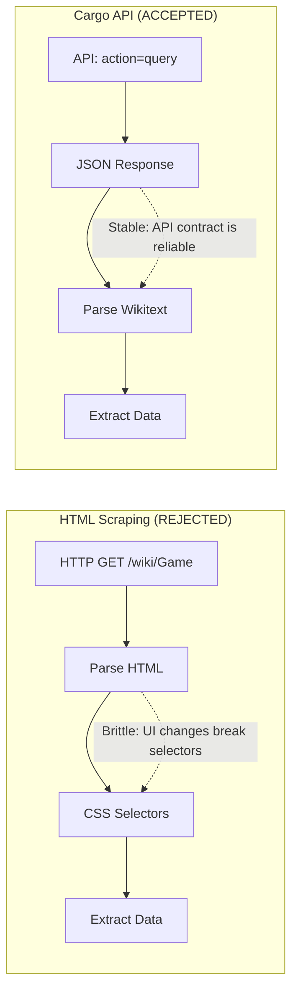
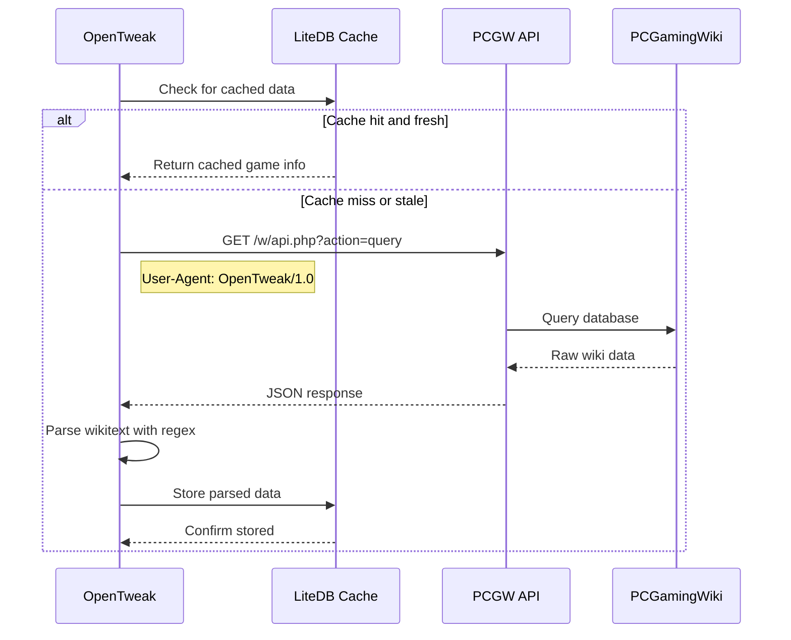

# ADR-002: PCGW Cargo API Over HTML Scraping

Status: Accepted
Date: 2026-02-01
Related Features: [`docs/Features/PCGWIntegration.md`](../Features/PCGWIntegration.md)

---

## Context

OpenTweak needs to fetch game information and tweak instructions from PCGamingWiki (PCGW). There are two primary approaches to extract data from a wiki:

1. **HTML Scraping**: Parse the rendered HTML pages using CSS selectors or regex
2. **Cargo API**: Use PCGW's structured MediaWiki API to query data directly

HTML scraping is brittle because:
- Page structure can change without notice
- CSS classes and IDs are not guaranteed to be stable
- Rendering differences between desktop/mobile versions
- Must handle JavaScript-rendered content
- Fragile to minor UI changes

PCGamingWiki provides a Cargo API (MediaWiki API with Cargo extension) that exposes structured data through query endpoints. This is the official, supported way to access wiki content programmatically.

---

## Decision

We will use the **PCGamingWiki Cargo API** instead of HTML scraping.

Key points:

- Use `action=query&list=search` for game search
- Use `action=parse&prop=wikitext` to get raw wiki content
- Parse wikitext with regex patterns to extract structured data
- Cache results in LiteDB to reduce API calls
- Respect rate limits with proper User-Agent headers

---

## Diagram

---

## Alternatives Considered

### Option A: HTML Scraping with AngleSharp

- **Pros**: Can extract rendered content; handles JavaScript; familiar approach
- **Cons**: Brittle to UI changes; slower (full page render); may violate Terms of Service; harder to test
- **Rejected because**: PCGW provides an official API; scraping is fragile and potentially against ToS

### Option B: Direct Database Access

- **Pros**: Fastest possible access; no API limitations
- **Cons**: Not available; would require PCGW cooperation; security concerns
- **Rejected because**: Not technically possible; PCGW does not offer database access

### Option C: Download Wiki Dump

- **Pros**: Complete offline access; no rate limits
- **Cons**: Large download (~GBs); stale data; complex parsing required
- **Rejected because**: Too heavy for a desktop app; data freshness is important

---

## Consequences

### Positive

- **Reliability**: API contract is stable; breaking changes are rare and announced
- **Performance**: JSON responses are smaller than HTML pages
- **Testing**: Can mock API responses for unit tests
- **Respectful**: Uses official API with proper User-Agent
- **Maintainability**: API documentation exists; not reverse-engineering HTML
- **Rate limiting**: API provides clear limits; can implement backoff

### Negative / Risks

- **Rate limits**: API has usage limits; aggressive use may be throttled
- **Dependency**: Relies on PCGW API availability
- **Wikitext parsing**: Still need to parse wiki markup (though more structured than HTML)
- **No semantic data**: API returns raw wikitext, not structured JSON fields

**Mitigation**:
- Implement caching in LiteDB ([`DatabaseService`](../../OpenTweak/Services/DatabaseService.cs))
- Respect rate limits with exponential backoff
- Graceful degradation: show cached data if API is unavailable
- Parser is tested and can be updated if wiki format changes

---

## Impact

### Code

- **Affected modules**: [`PCGWService`](../../OpenTweak/Services/PCGWService.cs)
- **Key methods**: `SearchGameAsync`, `GetPageContentAsync`, `GetAvailableTweaksAsync`
- **Base URL**: `https://www.pcgamingwiki.com/w/api.php`
- **User-Agent**: `OpenTweak/1.0 (Automated Game Tweaks)`

### API Endpoints Used

| Endpoint | Purpose |
|----------|---------|
| `action=query&list=search` | Search for game pages by title |
| `action=parse&prop=wikitext` | Get raw wiki markup for parsing |

### Testing

- Mock HTTP responses in [`PCGWServiceTests`](../../OpenTweak.Tests/Services/PCGWServiceTests.cs)
- Test parser regex patterns against sample wiki text
- Verify caching behavior

### Documentation

- API integration documented in [`docs/Features/PCGWIntegration.md`](../Features/PCGWIntegration.md)
- Parser patterns documented with examples
