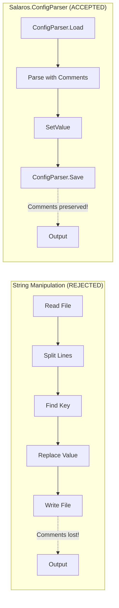
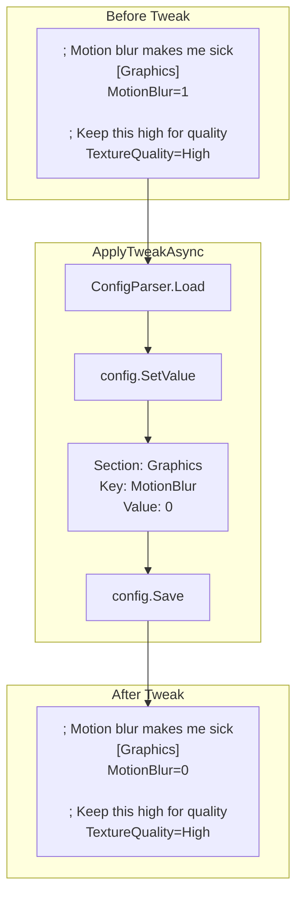

# ADR-003: Salaros.ConfigParser for INI Files

Status: Accepted
Date: 2026-02-01
Related Features: [`docs/Features/TweakEngine.md`](../Features/TweakEngine.md)

---

## Context

OpenTweak modifies INI and CFG configuration files for PC games. When editing these files, we face a critical choice:

1. **Standard .NET Configuration**: Use `System.Configuration` or simple string manipulation
2. **Custom Parser**: Write our own INI parser
3. **Third-party Library**: Use a specialized INI parser library

The key requirement is **preserving user comments and formatting**. Game configuration files often contain:
- User-added comments explaining settings
- Section headers with descriptions
- Whitespace and blank lines for readability
- Original ordering that users expect

Standard approaches like string manipulation or `System.Configuration` typically:
- Strip all comments
- Reorder sections alphabetically
- Normalize whitespace
- Lose the original file structure

This is unacceptable because users often have their own notes and organization in config files.

---

## Decision

We will use **Salaros.ConfigParser** (NuGet package) for all INI/CFG file operations.

Key points:

- Preserves comments, blank lines, and original formatting
- Safe read/write operations
- Supports multi-line values
- Handles various INI dialects (semicolon comments, hash comments, etc.)
- Actively maintained open-source library

---

## Diagram





---

## Alternatives Considered

### Option A: System.Configuration

- **Pros**: Built into .NET; no external dependencies
- **Cons**: Does not support comments; requires specific file structure; not designed for game INI files
- **Rejected because**: Cannot preserve user comments; too restrictive for game config formats

### Option B: Custom String Parser

- **Pros**: Full control over behavior; no external dependencies
- **Cons**: Time-consuming to implement correctly; edge cases (escaping, multi-line, encoding); maintenance burden
- **Rejected because**: Salaros.ConfigParser already solves this well; reinventing the wheel

### Option C: IniParser (another library)

- **Pros**: Popular library; many features
- **Cons**: Larger codebase; overkill for our needs; less focused on comment preservation
- **Rejected because**: Salaros.ConfigParser is lighter and specifically designed for safe editing with comment preservation

---

## Consequences

### Positive

- **Comment preservation**: User notes and explanations remain intact
- **Formatting preserved**: Blank lines, indentation, and ordering maintained
- **Safety**: Library handles edge cases (special characters, encoding)
- **Simplicity**: Clean API - Load, SetValue, Save
- **Multi-line support**: Handles values that span multiple lines
- **Tested**: Well-used library with existing test coverage

### Negative / Risks

- **External dependency**: Adds NuGet package (Salaros.ConfigParser 0.3.8)
- **Limited customization**: Must work within library's behavior
- **Maintenance**: Dependency on third-party project

**Mitigation**:
- Package is lightweight (~30KB)
- MIT licensed (permissive)
- Source code available if needed
- Can be replaced if necessary (parser is abstracted in [`TweakEngine`](../../OpenTweak/Services/TweakEngine.cs))

---

## Impact

### Code

- **Package**: `Salaros.ConfigParser` version `0.3.8`
- **Used in**: [`TweakEngine.ApplyIniTweakAsync`](../../OpenTweak/Services/TweakEngine.cs)
- **Settings**: `MultiLineValues = MultiLineValues.Simple`

### Usage Example

```csharp
// Load preserving comments
var config = new ConfigParser(filePath, new ConfigParserSettings
{
    MultiLineValues = MultiLineValues.Simple
});

// Modify value
config.SetValue("Graphics", "MotionBlur", "0");

// Save with original formatting intact
config.Save(filePath);
```

### Testing

- Tests verify comment preservation in [`TweakEngineTests`](../../OpenTweak.Tests/Services/TweakEngineTests.cs)
- Test cases include:
  - Files with extensive comments
  - Multi-line values
  - Various comment styles (; and #)
  - Unicode content

### Documentation

- Usage documented in [`docs/Features/TweakEngine.md`](../Features/TweakEngine.md)
- Safety feature: "Preserve Comments" listed as key feature
