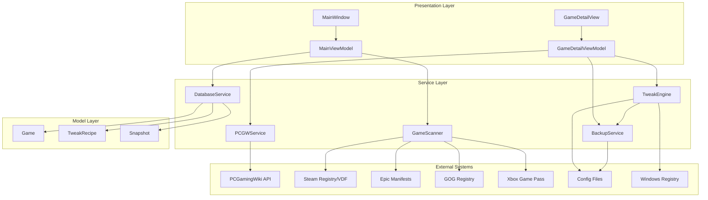
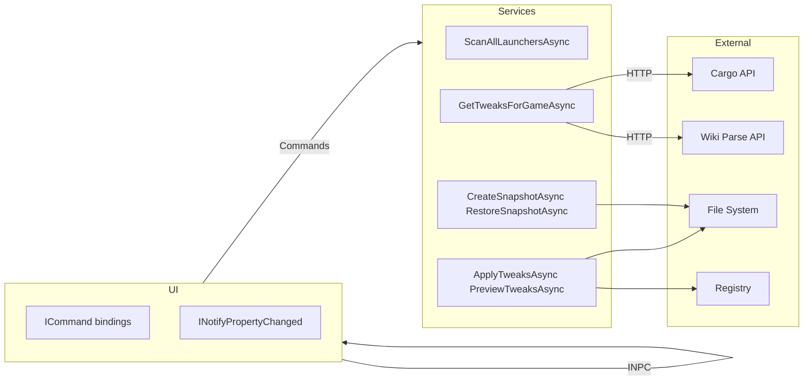
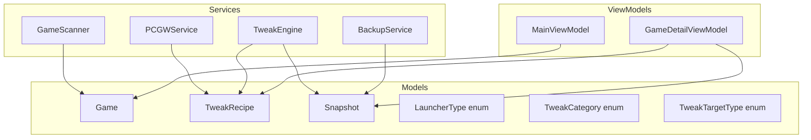

# Architecture Overview

**System:** OpenTweak - Transparent PC game optimization tool
**Stack:** C# / .NET 8 / WPF / WPFUI / LiteDB
**Entry Point:** [`OpenTweak/App.xaml.cs`](../../OpenTweak/App.xaml.cs) → [`MainWindow.xaml`](../../OpenTweak/Views/MainWindow.xaml)

---

## Summary

OpenTweak scans for installed games across multiple launchers, fetches tweak recipes from PCGamingWiki, and safely applies configuration changes with automatic backup and restore capabilities.

- **Where is the code:** [`OpenTweak/`](../../OpenTweak/)
- **Entry points:** [`App.xaml.cs`](../../OpenTweak/App.xaml.cs), [`MainWindow.xaml`](../../OpenTweak/Views/MainWindow.xaml)
- **Dependencies:** WPF-UI, LiteDB, Salaros.ConfigParser, CommunityToolkit.Mvvm

---

## Scoping

**In scope:**
- Game discovery from Steam, Epic, GOG, Xbox, Manual
- PCGamingWiki Cargo API integration
- Config file modification (INI, CFG, JSON, XML, Registry)
- Automatic backup and restore
- Windows 11 WPF UI with Mica backdrop

**Out of scope:**
- Game installation/management
- Online multiplayer modifications
- Cheat/hack detection bypass

---

## Diagrams

### System / Module Map

### Interfaces / Contracts Map

### Key Classes / Types Map

---

## Navigation Index

### Modules

| Module | Code | Entry Points | Description |
|--------|------|--------------|-------------|
| **Views** | [`OpenTweak/Views/`](../../OpenTweak/Views/) | [`MainWindow.xaml`](../../OpenTweak/Views/MainWindow.xaml), [`GameDetailView.xaml`](../../OpenTweak/Views/GameDetailView.xaml) | WPF UI with WPFUI styling |
| **ViewModels** | [`OpenTweak/ViewModels/`](../../OpenTweak/ViewModels/) | [`MainViewModel.cs`](../../OpenTweak/ViewModels/MainViewModel.cs), [`GameDetailViewModel.cs`](../../OpenTweak/ViewModels/GameDetailViewModel.cs) | MVVM logic with CommunityToolkit |
| **Services** | [`OpenTweak/Services/`](../../OpenTweak/Services/) | [`GameScanner.cs`](../../OpenTweak/Services/GameScanner.cs), [`PCGWService.cs`](../../OpenTweak/Services/PCGWService.cs), [`TweakEngine.cs`](../../OpenTweak/Services/TweakEngine.cs), [`BackupService.cs`](../../OpenTweak/Services/BackupService.cs) | Core business logic |
| **Models** | [`OpenTweak/Models/`](../../OpenTweak/Models/) | [`Game.cs`](../../OpenTweak/Models/Game.cs), [`TweakRecipe.cs`](../../OpenTweak/Models/TweakRecipe.cs), [`Snapshot.cs`](../../OpenTweak/Models/Snapshot.cs) | Data models |

### Key Classes / Types

| Type | Definition | Description |
|------|------------|-------------|
| [`Game`](../../OpenTweak/Models/Game.cs) | Model | Represents a detected game with metadata |
| [`TweakRecipe`](../../OpenTweak/Models/TweakRecipe.cs) | Model | Deterministic tweak from PCGW |
| [`Snapshot`](../../OpenTweak/Models/Snapshot.cs) | Model | Backup snapshot metadata |
| [`GameScanner`](../../OpenTweak/Services/GameScanner.cs) | Service | Multi-launcher game discovery |
| [`PCGWService`](../../OpenTweak/Services/PCGWService.cs) | Service | PCGamingWiki Cargo API client |
| [`TweakEngine`](../../OpenTweak/Services/TweakEngine.cs) | Service | Safe config modification with preview |
| [`BackupService`](../../OpenTweak/Services/BackupService.cs) | Service | File backup and restore |
| [`MainViewModel`](../../OpenTweak/ViewModels/MainViewModel.cs) | ViewModel | Main window state and commands |

### External Contracts

| Contract | Type | Source | Description |
|----------|------|--------|-------------|
| PCGW Cargo API | HTTP/JSON | PCGamingWiki | Structured game settings queries |
| PCGW Parse API | HTTP/JSON | PCGamingWiki | Wiki page content for fix extraction |
| Steam VDF | File | `%SteamPath%` | Library and game manifests |
| Epic Manifest | JSON | `%ProgramData%\Epic` | Game installation metadata |
| GOG Registry | Registry | `HKLM\SOFTWARE\GOG.com` | Game installation paths |

---

## Data Flow

1. **Discovery**: [`GameScanner.ScanAllLaunchersAsync()`](../../OpenTweak/Services/GameScanner.cs) → finds games → saves to [`DatabaseService`](../../OpenTweak/Services/DatabaseService.cs)
2. **Fetch Tweaks**: [`PCGWService.GetTweaksForGameAsync()`](../../OpenTweak/Services/PCGWService.cs) → queries PCGW Cargo API + parses wiki → returns [`List<TweakRecipe>`](../../OpenTweak/Models/TweakRecipe.cs)
3. **Preview**: [`TweakEngine.PreviewTweaksAsync()`](../../OpenTweak/Services/TweakEngine.cs) → reads current config values → returns diff
4. **Apply**: [`TweakEngine.ApplyTweaksAsync()`](../../OpenTweak/Services/TweakEngine.cs) → [`BackupService.CreateSnapshotAsync()`](../../OpenTweak/Services/BackupService.cs) → modifies configs
5. **Restore**: [`BackupService.RestoreSnapshotAsync()`](../../OpenTweak/Services/BackupService.cs) → restores files from backup
