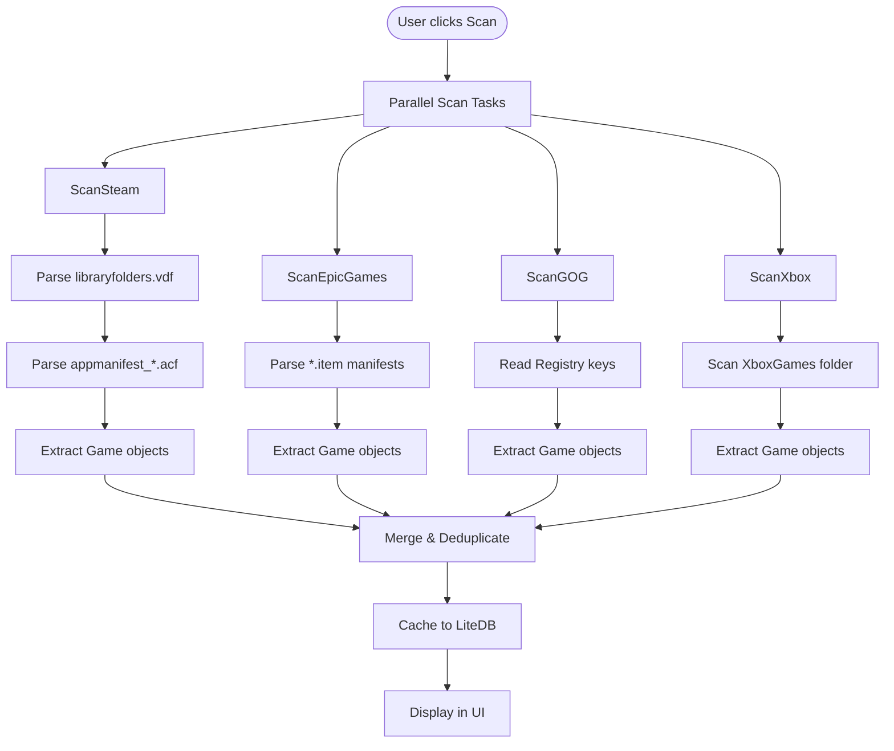

# Feature: GameDiscovery

Links:
Architecture: [`docs/Architecture/Overview.md`](../Architecture/Overview.md)
Code: [`OpenTweak/Services/GameScanner.cs`](../../OpenTweak/Services/GameScanner.cs)
Models: [`OpenTweak/Models/Game.cs`](../../OpenTweak/Models/Game.cs)
Tests: [`OpenTweak.Tests/Services/GameScannerTests.cs`](../../OpenTweak.Tests/Services/GameScannerTests.cs)

---

## Summary

Automatically scans for installed games across multiple PC game launchers (Steam, Epic Games, GOG, Xbox) and allows manual game addition. Returns a unified list of [`Game`](../../OpenTweak/Models/Game.cs) objects regardless of source.

---

## User Story

As a user, I want OpenTweak to automatically find all my installed games from different stores so I don't have to manually add each one. When I click "Scan for Games", the app should detect games from Steam, Epic, GOG, and Xbox Game Pass, showing them in a unified library.

---

## Flowchart



---

## API/Interface

### GameScanner

```csharp
public class GameScanner
{
    /// <summary>
    /// Scans all supported launchers in parallel.
    /// </summary>
    public async Task<List<Game>> ScanAllLaunchersAsync();

    /// <summary>
    /// Adds a game manually by path.
    /// </summary>
    public Game AddManualGame(string name, string installPath);
}
```

### LauncherType Enum

```csharp
public enum LauncherType
{
    Steam,      // Steam client games
    Epic,       // Epic Games Store
    GOG,        // GOG Galaxy
    Xbox,       // Xbox Game Pass / Microsoft Store
    Manual      // User-added games
}
```

### Game Model

```csharp
public class Game
{
    public Guid Id { get; set; }
    public string Name { get; set; }
    public string InstallPath { get; set; }
    public LauncherType LauncherType { get; set; }
    public string? AppId { get; set; }           // Store-specific ID
    public string? PCGWTitle { get; set; }       // For wiki lookups
    public List<string> ConfigPaths { get; set; }
}
```

---

## Configuration

### Steam Scanner
- **Registry**: `HKEY_CURRENT_USER\Software\Valve\Steam`
- **VDF Path**: `{SteamPath}\steamapps\libraryfolders.vdf`
- **Manifest Pattern**: `appmanifest_*.acf`
- **Format**: Valve Data Format (key-value pairs)

### Epic Scanner
- **Manifest Path**: `%ProgramData%\Epic\EpicGamesLauncher\Data\Manifests`
- **File Pattern**: `*.item`
- **Format**: JSON with `DisplayName`, `InstallLocation`, `CatalogItemId`

### GOG Scanner
- **Registry Paths**:
  - `HKEY_LOCAL_MACHINE\SOFTWARE\WOW6432Node\GOG.com\Games`
  - `HKEY_LOCAL_MACHINE\SOFTWARE\GOG.com\Games`
- **Keys**: `gameName`, `path`, `gameID`

### Xbox Scanner
- **Paths**:
  - `C:\XboxGames`
  - `%LocalAppData%\Packages`
- **Structure**: Game folder → `Content` subfolder

---

## Error Handling

| Scenario | Behavior |
|----------|----------|
| Launcher not installed | Skip silently, continue with others |
| Registry access denied | Log error, skip launcher |
| Corrupted manifest | Skip individual game, continue scanning |
| Duplicate game found | Merge data, prefer existing user edits |
