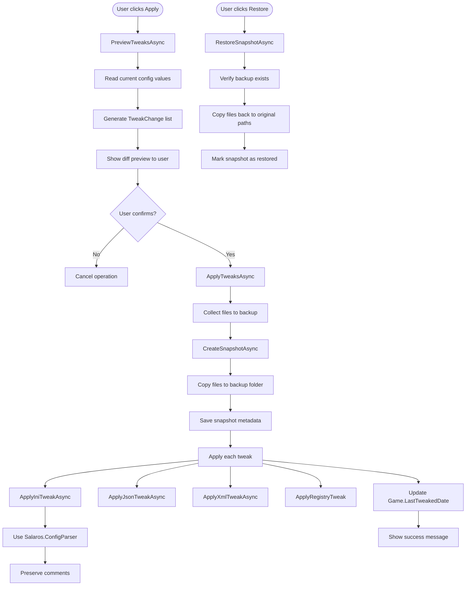

# Feature: TweakEngine

Links:
Architecture: [`docs/Architecture/Overview.md`](../Architecture/Overview.md)
Code: [`OpenTweak/Services/TweakEngine.cs`](../../OpenTweak/Services/TweakEngine.cs)
Backup: [`OpenTweak/Services/BackupService.cs`](../../OpenTweak/Services/BackupService.cs)
Models: [`OpenTweak/Models/TweakRecipe.cs`](../../OpenTweak/Models/TweakRecipe.cs), [`OpenTweak/Models/Snapshot.cs`](../../OpenTweak/Models/Snapshot.cs)
Tests: [`OpenTweak.Tests/Services/TweakEngineTests.cs`](../../OpenTweak.Tests/Services/TweakEngineTests.cs), [`OpenTweak.Tests/Services/BackupServiceTests.cs`](../../OpenTweak.Tests/Services/BackupServiceTests.cs)

---

## Summary

Safely applies configuration tweaks with automatic backup and restore capabilities. Supports INI, CFG, JSON, XML files, and Windows Registry modifications. Uses Salaros.ConfigParser to preserve comments in config files.

---

## User Story

As a user, I want to apply tweaks to my games with confidence. Before any changes are made, OpenTweak should create a backup. I want to preview what will change (diff view), apply the tweaks with one click, and be able to restore to the previous state if something goes wrong.

---

## Flowchart



---

## API/Interface

### TweakEngine

```csharp
public class TweakEngine
{
    public TweakEngine(BackupService backupService);

    /// <summary>
    /// Generates a preview of changes without applying them.
    /// </summary>
    public async Task<List<TweakChange>> PreviewTweaksAsync(IEnumerable<TweakRecipe> recipes);

    /// <summary>
    /// Applies tweaks after creating a backup snapshot.
    /// </summary>
    public async Task<Snapshot?> ApplyTweaksAsync(Game game, IEnumerable<TweakRecipe> recipes);
}
```

### TweakChange (Diff View)

```csharp
public class TweakChange
{
    public string FilePath { get; set; }
    public string Section { get; set; }
    public string Key { get; set; }
    public string? CurrentValue { get; set; }  // null = new entry
    public string NewValue { get; set; }
    public bool IsNewEntry { get; set; }
}
```

### BackupService

```csharp
public class BackupService
{
    /// <summary>
    /// Creates a snapshot of files before applying tweaks.
    /// </summary>
    public async Task<Snapshot> CreateSnapshotAsync(Game game, IEnumerable<string> filesToBackup, string? description);

    /// <summary>
    /// Restores files from a snapshot.
    /// </summary>
    public async Task<bool> RestoreSnapshotAsync(Snapshot snapshot, Game game);

    /// <summary>
    /// Gets all snapshots for a game.
    /// </summary>
    public async Task<List<Snapshot>> GetSnapshotsForGameAsync(Game game);

    /// <summary>
    /// Deletes a snapshot.
    /// </summary>
    public bool DeleteSnapshot(Snapshot snapshot);
}
```

### Snapshot

```csharp
public class Snapshot
{
    public Guid Id { get; set; }
    public Guid GameId { get; set; }
    public DateTime Timestamp { get; set; }
    public string BackupPath { get; set; }
    public List<string> FilesBackedUp { get; set; }
    public List<Guid> AppliedTweakIds { get; set; }
    public string Description { get; set; }
    public bool WasRestored { get; set; }
    public DateTime? RestoredDate { get; set; }
}
```

---

## Configuration

### Backup Storage

```
%LocalAppData%\OpenTweak\Backups\
  {SanitizedGameName}\
    {yyyy-MM-dd_HH-mm-ss}\
      relative\path\to\config.ini
```

### Supported File Types

| Type | Handler | Library |
|------|---------|---------|
| INI/CFG | `ApplyIniTweakAsync` | Salaros.ConfigParser |
| JSON | `ApplyJsonTweakAsync` | System.Text.Json |
| XML | `ApplyXmlTweakAsync` | System.Xml.XmlDocument |
| Registry | `ApplyRegistryTweak` | Microsoft.Win32.Registry |

### Environment Variable Expansion

File paths support environment variables:
- `%USERPROFILE%`
- `%APPDATA%`
- `%LOCALAPPDATA%`
- `%PROGRAMFILES%`

---

## Safety Features

1. **Backup First**: Snapshot created before any changes
2. **Preview Mode**: Shows diff before applying
3. **Atomic Per-File**: Each file is backed up individually
4. **Restore Anytime**: Snapshots can be restored later
5. **Preserve Comments**: INI files keep original formatting

---

## Error Handling

| Scenario | Behavior |
|----------|----------|
| File locked | Skip file, log error, continue with others |
| Backup fails | Abort apply operation |
| Apply fails mid-way | Keep snapshot, allow restore |
| Restore fails | Log which files failed |
| Missing backup | Return false, show error |
