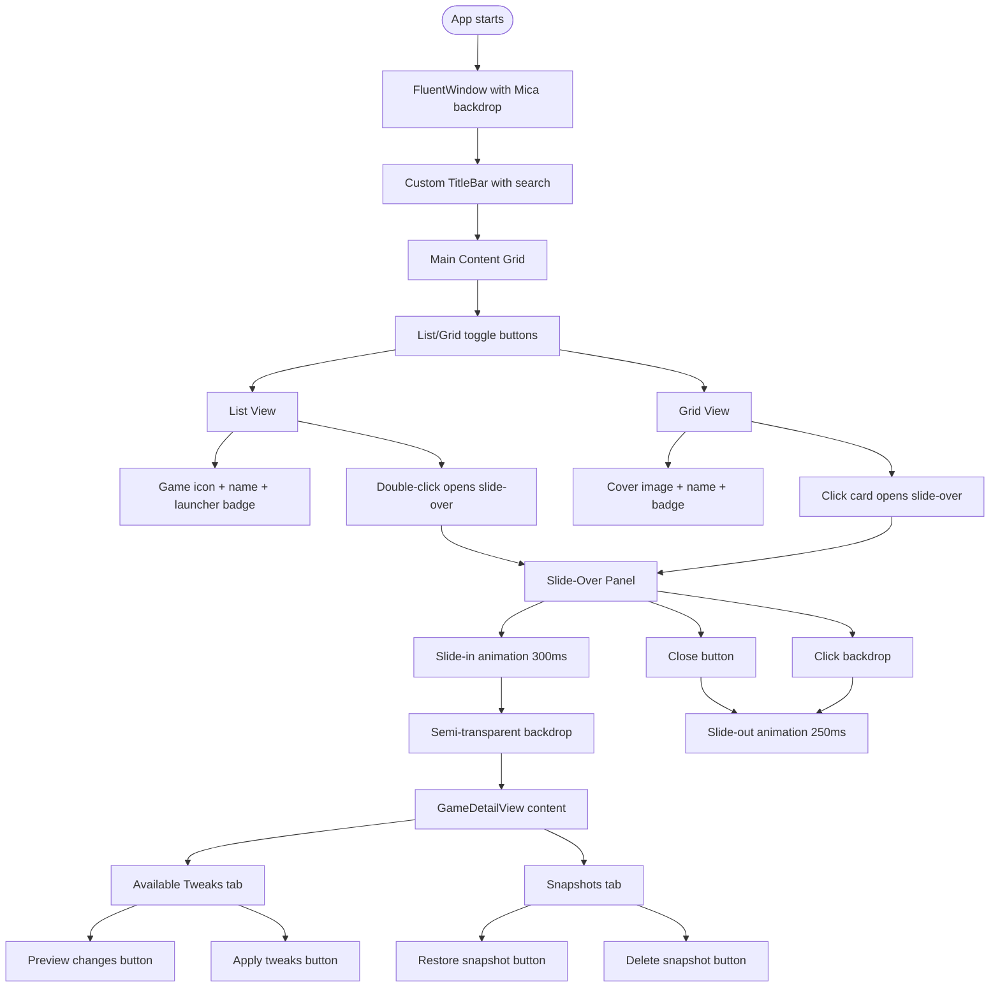

# Feature: UI-GridView

Links:
Architecture: [`docs/Architecture/Overview.md`](../Architecture/Overview.md)
MainWindow: [`OpenTweak/Views/MainWindow.xaml`](../../OpenTweak/Views/MainWindow.xaml), [`OpenTweak/Views/MainWindow.xaml.cs`](../../OpenTweak/Views/MainWindow.xaml.cs)
GameDetail: [`OpenTweak/Views/GameDetailView.xaml`](../../OpenTweak/Views/GameDetailView.xaml)
ViewModels: [`OpenTweak/ViewModels/MainViewModel.cs`](../../OpenTweak/ViewModels/MainViewModel.cs), [`OpenTweak/ViewModels/GameDetailViewModel.cs`](../../OpenTweak/ViewModels/GameDetailViewModel.cs)

---

## Summary

Modern Windows 11 WPF UI using WPF-UI library with Mica backdrop, featuring list/grid view toggle, animated slide-over panel for game details, and fluent design principles.

---

## User Story

As a user, I want a modern, beautiful interface that feels native to Windows 11. I want to toggle between a compact list view and a visual grid view for my games. When I select a game, a smooth slide-over panel should appear from the right showing game details and available tweaks, without losing context of my game library.

---

## Flowchart



---

## API/Interface

### MainViewModel

```csharp
public partial class MainViewModel : ObservableObject
{
    [ObservableProperty]
    private ObservableCollection<Game> _games;

    [ObservableProperty]
    private Game? _selectedGame;

    [ObservableProperty]
    private ViewMode _currentViewMode = ViewMode.List;

    [ObservableProperty]
    private bool _isSlideOverOpen;

    [ObservableProperty]
    private bool _isScanning;

    [ObservableProperty]
    private string _searchQuery;

    [RelayCommand]
    private async Task ScanForGamesAsync();

    [RelayCommand]
    private void SetListView();

    [RelayCommand]
    private void SetGridView();

    [RelayCommand]
    public void OpenGameDetails(Game game);

    [RelayCommand]
    public void CloseSlideOver();
}
```

### ViewMode Enum

```csharp
public enum ViewMode
{
    List,   // Compact vertical list
    Grid    // Visual card grid
}
```

### MainWindow (Code-Behind)

```csharp
public partial class MainWindow : FluentWindow
{
    // Animation storyboards
    private Storyboard? _slideInStoryboard;
    private Storyboard? _slideOutStoryboard;
    private Storyboard? _fadeInStoryboard;
    private Storyboard? _fadeOutStoryboard;

    private void InitializeAnimations();
    private void OpenSlideOver();
    private void CloseSlideOver();
    private void OnGameDoubleClick(object sender, MouseButtonEventArgs e);
    private void OnGameCardClick(object sender, MouseButtonEventArgs e);
    private void OnBackdropClick(object sender, MouseButtonEventArgs e);
}
```

---

## Configuration

### Window Settings

```xml
<ui:FluentWindow
    Title="OpenTweak"
    Height="720"
    Width="1280"
    MinHeight="600"
    MinWidth="900"
    WindowStartupLocation="CenterScreen"
    ExtendsContentIntoTitleBar="True"
    WindowBackdropType="Mica">
```

### Slide-Over Panel

```xml
<Border x:Name="SlideOverPanel"
        Width="500"
        HorizontalAlignment="Right"
        CornerRadius="8,0,0,8"
        BorderThickness="1,0,0,0">
    <Border.RenderTransform>
        <TranslateTransform X="520"/>  // Hidden by default
    </Border.RenderTransform>
</Border>
```

### Animations

| Animation | Duration | Easing | Description |
|-----------|----------|--------|-------------|
| Slide In | 300ms | CubicEase.EaseOut | Panel slides from right |
| Slide Out | 250ms | CubicEase.EaseIn | Panel slides to right |
| Fade In | 200ms | Linear | Backdrop appears |
| Fade Out | 200ms | Linear | Backdrop disappears |

---

## Visual Design

### List View
- Game icon (48x48) with rounded corners
- Game name with ellipsis truncation
- Launcher type badge (colored)
- Double-click to open details

### Grid View
- Cover image with placeholder fallback
- 200x280 card size with 8px margin
- Hover effect (opacity + background change)
- Click to open details

### Slide-Over Panel
- 500px width
- Mica/Acrylic background
- Close button (top-right)
- Game header with name and launcher badge
- Tabs: "Available Tweaks" and "Snapshots"

### Theme Resources

```xml
{ui:ThemeResource CardBackgroundFillColorDefaultBrush}
{ui:ThemeResource CardStrokeColorDefaultBrush}
{ui:ThemeResource ControlFillColorDefaultBrush}
{ui:ThemeResource AccentFillColorDefaultBrush}
```

---

## Error Handling

| Scenario | Behavior |
|----------|----------|
| Missing cover image | Show placeholder icon |
| Animation error | Panel still functional |
| Null game selection | Disable slide-over |
